# SAA-Nishiki（二式）

[English](README.md) | **日本語** | [简体中文](README.zh-CN.md)

[Character Select SAA](https://github.com/mirabarukaso/character_select_stand_alone_app) のフォークです。AI プロンプト、セミオートのタグ補完、ComfyUI / Forge Neo (WebUI) API に対応したスタンドアロンアプリです。
Nishiki では、日本語タグ翻訳、カスタム欄とプリセットを持つカプセル型プロンプトエディタ、編集可能なリスト管理、Undo / Redo、AI プロンプトリファイナー、高速生成モード、Runpod Pod ターゲットを追加しています。

現在のリリース: **v2.8.9-nishiki.1** — 上流 SAA v2.8.9 ベース。ダウンロードとリリースノートは [Releases](https://github.com/FUMIHITO-EGUCHI/saa-nishiki/releases) を参照してください。

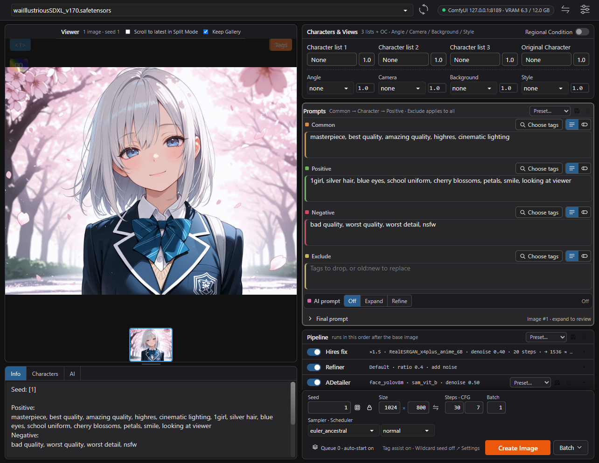

## 目次
- [Nishiki の追加機能](#nishiki-の追加機能)
- [インストールと起動](#インストールと起動)
- [更新](#更新)
- [Highlights（上流由来の機能）](#highlights)
- [AI プロンプト](#ai-プロンプト)
- [Image API Interface](#image-api-interface)
- [FAQ](#faq)

------

# Nishiki の追加機能

## 日本語タグ翻訳・ローカライズ
- danbooru / e621 統合タグリストの日本語辞書（約 10 万エントリ、`data/danbooru_e621_merged_ja.csv`）により、日本語でタグを検索・表示できます。
- キャラクター名・作品名の日本語ローカライズと、タグカテゴリ表示。
- 設定で UI 言語に `ja-JP` を選択すると、タグ・名前・カテゴリが日本語で表示されます。日本語訳のない UI 文言は英語にフォールバックします。

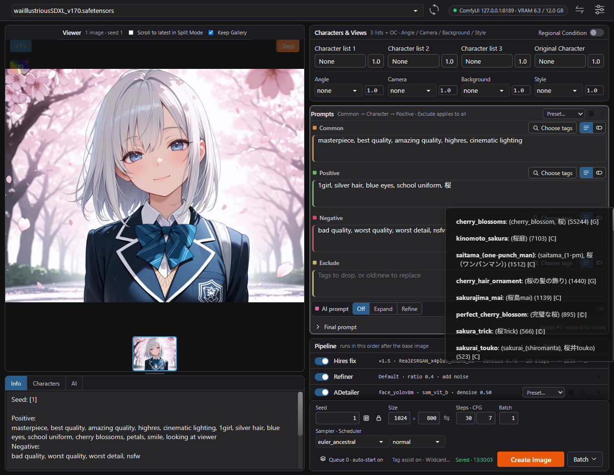

## プロンプトエディタ
従来のテキストボックスを、欄の一覧と 1 つの大きなフォーカスエディタに置き換えました。各欄は **カプセル**（タグ 1 つにつき 1 チップ）または **テキスト** で表示でき、表示モードは全欄で共通です。


- **カスタム欄。** Positive 系・Negative 系の両方で、独自の欄（例: `Face`、`Body`、`Background`、`Style`）を追加・名前変更・並べ替え・削除できます。最終的なプロンプトは、並べた順に各欄を連結して組み立てられます。
- **タグ単位のウェイト。** カプセルをクリックするとウェイトのポップオーバーが開きます。テキストモードでは `Ctrl + ↑ / ↓` で調整できます。一括ダイアログで複数タグのウェイトをまとめて変更できます。
- **ワンタッチ有効 / 無効。** タグを削除せずに無効化できます。無効タグは欄に残りますが、生成には使われません。
- **欄間のタグ移動。** カプセルを他の欄へドラッグ（`Ctrl` または `Alt` でコピー）するか、右クリックの `Move to…` / `Copy to…` を使います。ウェイトと無効状態も一緒に移動します。テキストモードでは選択範囲に対して同じ操作ができます。
- **プリセット。** 欄ごとにプリセットの一覧を持ちます。プロンプトプリセットは欄の構成（欄・名前・順序・内容）をまるごと保存し、適用するとその構成をそのまま復元します。
- **関連タグ候補（オフライン）。** カプセルにフォーカスすると、欄の下に「よく一緒に使われるタグ」（同梱の共起辞書 `data/tag_related.txt` 由来）と同じ語族のタグが表示されます。クリックで挿入。欄フッターの ✦ ボタンで ON / OFF を切り替えます。
- **検索。** オートコンプリートは既定でタグ名の前方・中間・後方一致すべてに対応します。
- テキストエディタは内容に応じて自動で伸びるため、長いプロンプトが見切れません。

## ウェイトバッチ
タグに **ウェイトプラン**（開始・刻み・終了）を設定してバッチを実行すると、SAA は Seed を固定したまま 1 枚ずつウェイトだけを変えて生成します。`÷ batch count` を選ぶと刻み幅をバッチ回数から自動算出します。Seed がランダムでない状態でバッチを始めると確認が表示されます。

## 選択モーダル・お気に入り・リスト管理
- キャラクター、オリジナルキャラクター、アングル、カメラ、タグは、翻訳と **お気に入り** グループを備えた検索可能な選択モーダルから選びます。お気に入りタグはカプセル上でも強調表示されます。
- キャラクタースロット数は 3 固定ではなくなり、必要な数だけ追加できます。
- **リスト管理**（設定 → Lists）: キャラクター / OC / アングル / カメラ各リストのエントリを追加・上書き・非表示にできます。上流データは読み取り専用のままで、編集内容は差分として `settings/user_lists.json` に保存され、エクスポート / インポートできます。エントリには複数タグのプロンプトを持たせられ、エントリ編集画面からタグ辞書ピッカーを開けます。

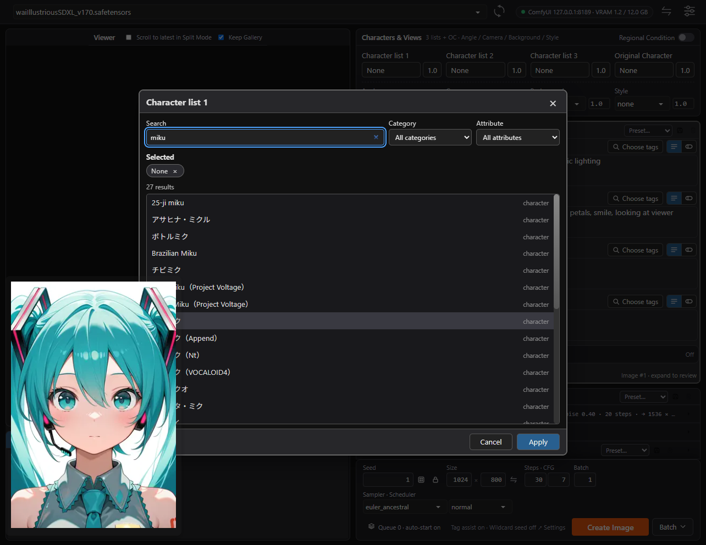

## Undo / Redo
プロンプト編集、プリセット適用、AI リファインの結果は、すべてグローバルな編集履歴の 1 ステップとして記録されます。`Ctrl + Z` / `Ctrl + Shift + Z`（または `Ctrl + Y`）かツールバーのボタンで操作します。

## AI プロンプトリファイナー
上流のリモート / ローカル `llama.cpp` AI プロンプトに加えて、[Ollama](https://ollama.com/) を使う **Refine** モードを追加しました。Refine は各バッチの 1 枚目を生成する前に、構造化リクエスト 1 回でプロンプト全体を書き直し、結果を欄ごとにエディタへ適用します。Refine の編集は履歴に記録され、Undo できます。
AI の結果は生成のたびにポップアップするのではなく、**Info パネルの AI タブ** に表示されます。

## 高速生成モード
設定 → Backend → **Fast generation** で、ステップ蒸留 LoRA（DMD2 / Hyper-SD / Lightning / LCM）を適用し、ベース・Hires fix・ADetailer 各パスの steps / CFG / sampler / scheduler を上書きします。ローカル ComfyUI と Pod の両方で動作します。
RTX 4070 SUPER での実測（600×1024、Hires 1.5x、ADetailer あり）: 30 steps ≈ 29 秒 → DMD2 8 steps ≈ 16 秒。

## Runpod Pod ターゲット
設定で Runpod の Pod（SSH 接続先と鍵）を登録すると、ツールバーのステータスピルで画像生成先を **GPU: Local** と **GPU: Pod** の間で切り替えられます。生成画像は SSH 経由でストリーミングされてローカルにのみ保存され、Pod のディスクには何も書き込まれません。Pod は LLM 機能（AI プロンプト / Refine）のホストにもなれます。Pod のエンドポイントでは認証付きの `https` / `wss` バックエンドに対応しています。

## ギャラリーと Info パネル
- Info パネルはギャラリーで選択中の画像に追従し、埋め込まれた PNG パラメータも表示します。
- 右クリックメニューは対象（カプセル、プロンプト欄、ギャラリー画像、AI 欄）ごとに内容が変わります。

## UI シェル
ビューポートレイアウト、ステータスピル、生成進捗表示、ダイアログシェルの新設計と、ダーク / ライトテーマの CSS 刷新。

## 設定の保存先
設定はセクションに分割され、スキーマバージョン付きで保存されます。
- `settings/app.json` — アプリ設定（バックエンド、パス、AI、高速モード、Pod）
- `settings/state.json` — プロンプト / 生成 / LoRA / ADetailer / ControlNet の作業状態
- `settings/presets/<section>/<name>.json` — プリセット
- `settings/user_lists.json` — リスト管理の差分
- `settings/legacy/` — 分割前の `settings/*.json`。初回起動時にここへ移動され、以降は読み込まれません

すべて自動保存・アトミック書き込みです。`settings/` は同梱の MiraITU ワークフローファイルを除いて git 管理外です。

## バージョニング
バージョンは `<upstream-version>-nishiki.<generation>` 形式（例: `2.8.9-nishiki.1`）です。ベース部分はマージした上流のバージョンで、上流をマージするたびに generation を `.1` にリセットし、フォーク独自のリリースで generation を加算します。

------

> [!NOTE]
> リストに表示されないものの正しく生成できるキャラクターを見つけたら、issue で知らせてください。
>
> 既定の thumbList は `waiIllustriousSDXL_v160` ベースです。代替の thumbList `waiANIMA_v10Base10` と `waiNSFWIllustrious_v120` は、選択すると `HuggingFace` から自動ダウンロードされます。
> 独自の thumbList は [SAA Thumb Generator](scripts/python/thumb-generator/README.md) で作成できます。

| 検証済み | [ComfyUI](https://github.com/comfyanonymous/ComfyUI)  | [Forge Neo](https://github.com/Haoming02/sd-webui-forge-classic/tree/neo) |
| --- | --- | --- |
| Release | 0.28.0 | 2.27 |
| Refiner (SDXL) | Yes | Yes |
| Image Color Transfer (ALL) | Yes | No |
| Regional Condition / Couple (SDXL/Anima) | Yes | Yes |
| ControlNet/IPA (SDXL) | Yes | Yes |
| ADetailer (ALL) | Yes | Yes |
| API authentication| No | Yes |
| MiraITU | Yes | No |
| 高速生成モード | Yes | No |
| Runpod Pod ターゲット | Yes | No |

> [!IMPORTANT]
> `Forge Neo` の `Regional Condition / Couple` と `ADetailer` は `SDXL と Anima` に対応。
> `ComfyUI` では SAA が対応するすべての diffusion モデルで動作するはずですが、要検証です。
>
> *ComfyUI Desktop は非対応です。*
> *A1111 はメンテナンス停止のため対応リストから外しました。SAA で動作はしますがテストしていません。*
>
> *オンライン版 Character Select* [Hugging Face Space](https://huggingface.co/spaces/flagrantia/character_select_saa)
>
> ブラウザ版 SAAC は [README_SAAC.md](README_SAAC.md) を参照。
> OpenClaw 向け Python CLI ツールは [SAA Agent](scripts/python/saa-agent/README_HUMAN.md) と [ClawHub](https://clawhub.ai/mirabarukaso/saa-agent) を参照。

## thumbList 手動ダウンロード
<details>
<summary>SAA 内のダウンロードが遅い、または失敗する場合は手動でダウンロードしてください。</summary>

[HF データセット](https://huggingface.co/datasets/flagrantia/character_select_stand_alone_app/tree/main) から以下のファイルを `data` フォルダにダウンロードし、次の名前にリネームします。

### waiIllustriousSDXL_v160
[waiIllustriousSDXL_v160_thumbs.json](https://huggingface.co/datasets/flagrantia/character_select_stand_alone_app/resolve/main/wai_character_thumbs_v160.json?download=true)

[waiIllustriousSDXL_v160_characters.csv](https://huggingface.co/datasets/flagrantia/character_select_stand_alone_app/raw/main/wai_characters_v160.csv)

[waiIllustriousSDXL_v160_tag_assist.json](https://huggingface.co/datasets/flagrantia/character_select_stand_alone_app/raw/main/waiIllustriousSDXL_v160_tag_assist.json)

### waiIllustriousSDXL_v120
[waiNSFWIllustrious_v120_thumbs.json](https://huggingface.co/datasets/flagrantia/character_select_stand_alone_app/resolve/main/wai_character_thumbs_v120.json?download=true)

[waiNSFWIllustrious_v120_characters.csv](https://huggingface.co/datasets/flagrantia/character_select_stand_alone_app/raw/main/wai_characters_v120.csv)

[waiNSFWIllustrious_v120_tag_assist.json](https://huggingface.co/datasets/flagrantia/character_select_stand_alone_app/raw/main/waiIllustriousSDXL_v160_tag_assist.json)

### waiANIMA_v10Base10
[waiANIMA_v10Base10_thumbs.json](https://huggingface.co/datasets/flagrantia/character_select_stand_alone_app/resolve/main/waiANIMA_v10Base10_thumbs.json?download=true)

[waiANIMA_v10Base10_characters.csv](https://huggingface.co/datasets/flagrantia/character_select_stand_alone_app/raw/main/waiANIMA_v10Base10_characters.csv)

[waiANIMA_v10Base10_tag_assist.json](https://huggingface.co/datasets/flagrantia/character_select_stand_alone_app/raw/main/waiANIMA_v10Base10_tag_assist.json)

</details>

# インストールと起動
> [!TIP]
> SAA を起動する前に [Image API Interface](#image-api-interface) を設定してください。
>
> ComfyUI の場合は最新の [ComfyUI_Mira](https://github.com/mirabarukaso/ComfyUI_Mira) が必要です。
>
> *ワンクリックパッケージ v2.8.0（上流）*
> フルパッケージ [embeded_env_for_SAA](https://huggingface.co/datasets/flagrantia/character_select_stand_alone_app/resolve/main/embeded_env_for_SAA.zip)

リポジトリをローカルにクローンします。
```
git clone https://github.com/FUMIHITO-EGUCHI/saa-nishiki.git
cd saa-nishiki
npm install
npm start
```

### ローカル CDP デバッグ（任意）

CDP は既定で無効です。Chrome DevTools や互換の MCP クライアントから Electron レンダラーを検査するには、ローカルのデバッグポートを指定して SAA を起動します。

```powershell
$env:SAA_CDP_PORT = "9222"
npm start
```

パッケージ済みの実行ファイルでは次のオプションが同等です。

```powershell
.\saa.exe --saa-cdp-port=9222
```

SAA の実行中は `http://127.0.0.1:9222/json/list` で DevTools エンドポイントを利用できます。`9222` が使用中なら別のポートを指定してください。CDP はレンダラーの検査・操作が可能なため、信頼できないマシンや外部から到達可能なマシンでは有効にしないでください。

# 更新
> [!IMPORTANT]
> **GitHub からの更新ではデータセットファイルは更新されません。**
> `data` フォルダ内の `danbooru_e621_merged.csv`、`*_thumbs.json`、`*_characters.csv`、`*_tag_assist.json` を手動で削除し、アプリを再起動すると最新のサムネイルデータベースを HF からダウンロードします。

```
git fetch
git pull
npm install
```

設定・プリセット・リスト管理の差分は `settings/` にあり、更新で変更されることはありません。

------
# Highlights
以下は上流 SAA から引き継いだ機能です。スクリーンショットは可能な範囲で Nishiki UI で撮り直しています。

## ComfyUI / Forge Neo 向け Diffusion モデル（UNET/CLIP/VAE）
> [!NOTE]
> テスト・検証済み: Anima / Qwen Image / Z Image / Flux / Krea2
> ComfyUI と Forge Neo に対応。オリジナルの A1111 は非対応。


> [!NOTE]
> 上のスクリーンショットは旧（上流）UI のものです。

<details>
<summary>Diffusion モデルの詳細</summary>

*ComfyUI* は [Comfy-Org@HF](https://huggingface.co/comfy-Org/) を参照。
`GGUF モデル` にはカスタムノード [gguf](https://github.com/calcuis/gguf)（小文字のもの）が必要です。
```
|---models
|   |---checkpoints
|   |---diffusion_models
|   |---text_encoders
|   |---vae
```

*Forge Neo* は [Download Models@Haoming02](https://github.com/Haoming02/sd-webui-forge-classic/wiki/Download-Models) を参照。
Forge も `GGUF モデル` に対応しますが、`Diffusion モデル` は `Checkpoint` と同じフォルダを使います。正しいフォルダで管理してください。
```
|---models
|   |---Stable-diffusion
|   |---text_encoder
|   |---VAE
```
</details>

## Mira Image Tiled Upscaler
> [!NOTE]
> MiraITU: ビジョンモデルに基づくコンテンツ認識型の画像超解像 ComfyUI カスタムノード。
> 任意の画像を SAA/SAAC にドラッグ&ドロップするだけでアップスケールできます。

| Before | 6x After (SDXL) | Before | 3x After (Flux.2) |
| --- | --- | --- | --- |
|    |   |    |   |

<details>
<summary>MiraITU の詳細</summary>

1.5 倍から 8 倍までの拡大に対応。タイルサイズの調整で VRAM 使用量を最適化でき、8GB の GPU でも 1.5〜3 倍（以上）、24GB 以上のハイエンド GPU なら 4〜8 倍のアップスケールが可能です。

[ComfyUI_Mira](https://github.com/mirabarukaso/ComfyUI_Mira) `0.5.6.0 以上` が必要
[MiraSubPack](https://github.com/mirabarukaso/ComfyUI_MiraSubPack) `最新版` が必要

および [Mira](https://github.com/mirabarukaso/ComfyUI_Mira#tagger) の Image Tagger

| Settings | Drag and Drop | Flux.2 |
| --- | --- | --- |
| 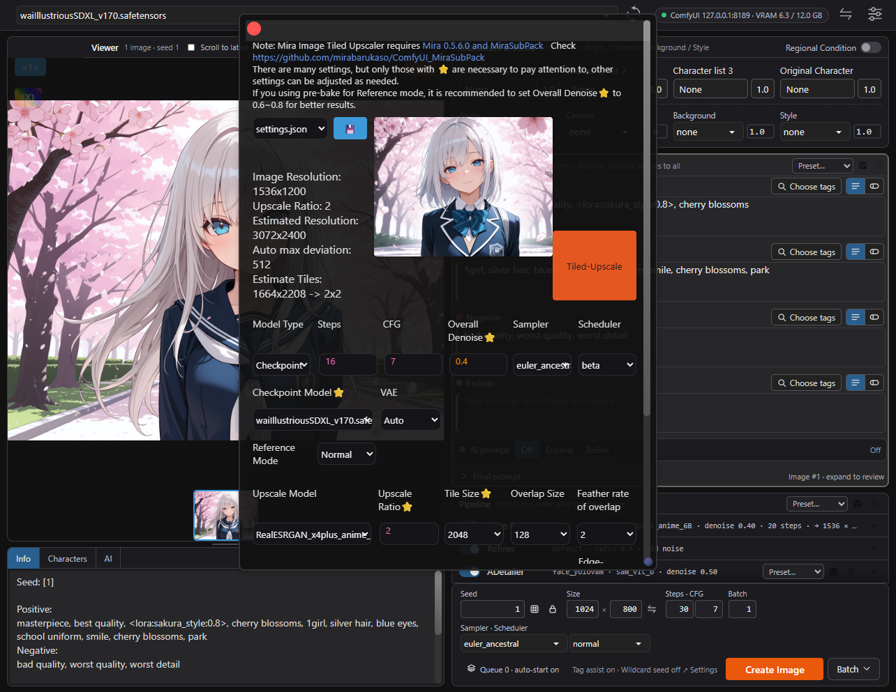 | 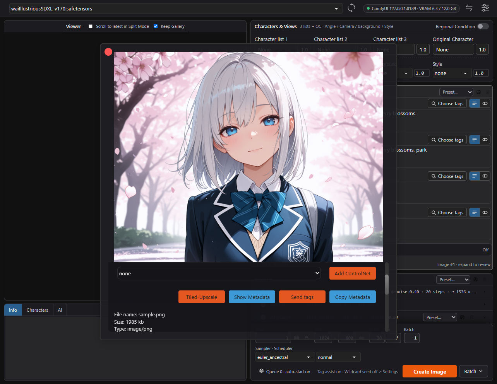   | 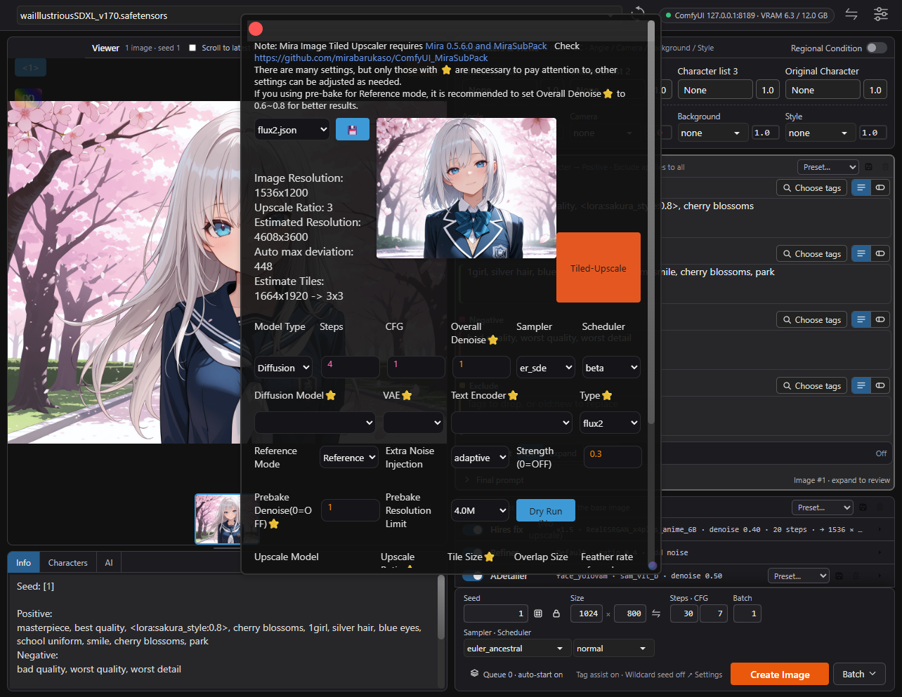   |

生成結果はモデルによって変わります。`SDXL` モデルでは正確な内容記述のために `tagger` が必要で、`upscale モデル` の使用を推奨します。`reference latent` を接続できる `Flux2` などのモデルでは upscale モデルを省略して元画像を直接引き伸ばせます。その場合は `Positive Prompt` で全タイルを統一的に設定してください。

| 拡大率 1024x1360(1536) | Tile Size | VAE 8G | VAE 24G~ |
| --- | --- | --- | --- |
| x1.5 | 768 | Full | Full |
| x2 | 1280 | Full/Tiled | Full |
| x3 | 1536 | Tiled | Full |
| x4 | 2048 | Tiled | Full |
| x6 | 2048/2560 | Tiled | Full |
| x8 | 2560/3072 | Tiled | Full/Tiled |

注: SDXL モデルの制約により、8 倍を超える拡大では視覚的な断片化が激しくなります。より高倍率が必要な場合は専用の ComfyUI ワークフローを使用してください。
[ComfyUI Workflow MiraITU](https://github.com/mirabarukaso/ComfyUI_MiraSubPack/blob/main/examples/MiraITU_workflow.png)
</details>

## Image Tagger
ONNX 形式の [WD@SmilingWolf](https://huggingface.co/SmilingWolf)、[CL@cella110n](https://huggingface.co/cella110n/cl_tagger)、[Camie@Camais03](https://huggingface.co/spaces/Camais03/camie-tagger-v2-app) モデルに対応。

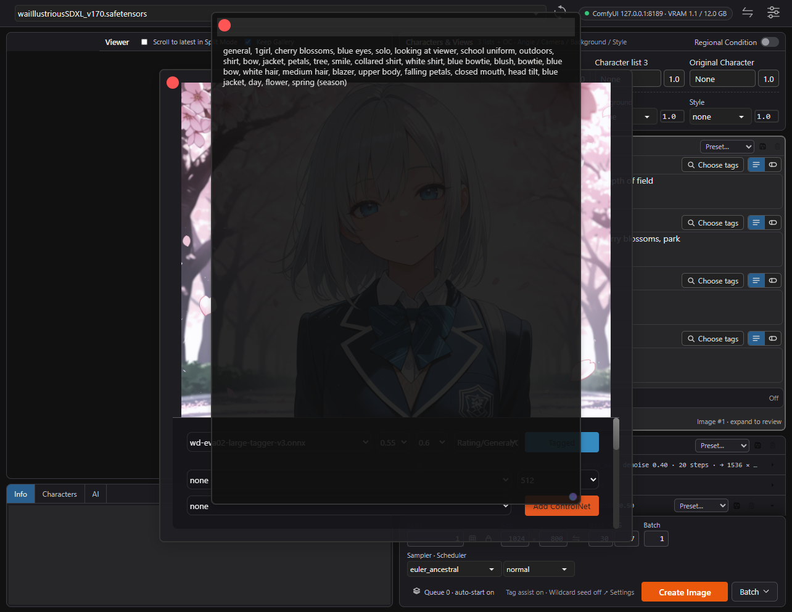

<details>
<summary>Image Tagger の詳細</summary>

[HF](https://huggingface.co) からタグ付きのモデルをダウンロードし、次の規則でリネームして `models/tagger` フォルダにコピーします。
  - cl_tagger_v2.onnx + cl_tagger_v2_tag_mapping.json
  - wd-eva02-large-tagger-v3.onnx + wd-eva02-large-tagger-v3_selected_tags.csv
  - wd-v1-4-convnext-tagger.onnx + wd-v1-4-convnext-tagger_selected_tags.csv

```
SAA
|---models
|   |---tagger
|       |---cl_tagger_1_02.onnx
|       |---cl_tagger_1_02_tag_mapping.json
|       |---wd-eva02-large-tagger-v3.onnx
|       |---wd-eva02-large-tagger-v3_selected_tags.csv
|       |---wd-vit-large-tagger-v3.onnx
|       |---wd-vit-large-tagger-v3_selected_tags.csv
|       |---camie-tagger-v2.onnx
|       |---camie-tagger-v2-metadata.json

Options:
Model Name  >>>  General Threshold(CL/WD/Camie)  >>>  Character Threshold(CL/WD)  >>> Categories(CL/Camie) or mCut(WD)
```

Image Tagger は Node.js 上の `onnxruntime-node` で動作します。*バックエンドは不要* ですが、GPU アクセラレーションは効かないようです。
タグ付け速度は CPU モードの `Python` + `onnxruntime` の約 3 倍、`onnxruntime-gpu` の約 12 倍遅くなります。
その代わり、生成中でも `Image tagger` を実行できます。

| Device | Avg Tagging Time | Model | Platform | Resolution | Recommend Value |
| --- | --- | --- | --- | --- | --- |
| onnxruntime | 1.053s | cl_tagger_1_02 | Python | 448 | 0.55/0.60 |
| onnxruntime-gpu | 0.297s | cl_tagger_1_02 | Python | 448 | 0.55/0.60 |
| onnxruntime-node | 3.185s | cl_tagger_1_02 | Electron(NodeJS@CPU) | 448 | 0.55/0.60 |
| onnxruntime-node | 2.917s | wd-eva02-large-tagger-v3 | Electron(NodeJS@CPU) | 448 | 0.35/0.85 |
| onnxruntime-node | 2.113s | camie-tagger-v2 | Electron(NodeJS@CPU) | 512 |  0.50/(NOT USE) |
</details>

## ControlNet / IP Adapter
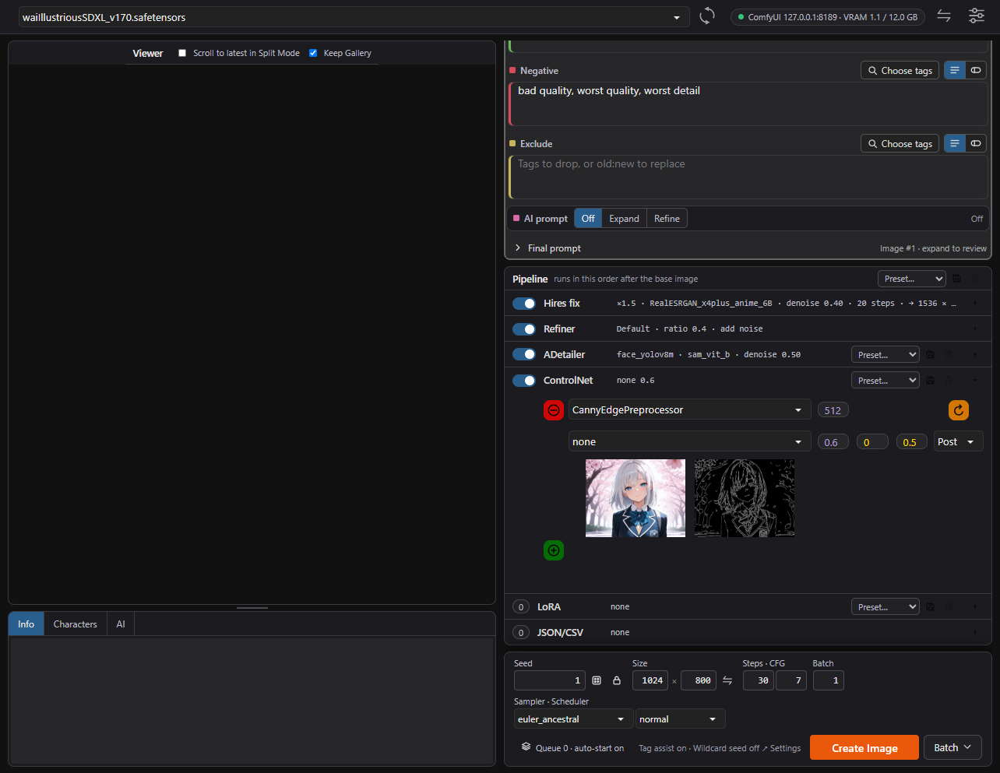

<details>
<summary>ControlNet / IP Adapter の詳細</summary>

### ComfyUI の場合
[ComfyUI_Mira](https://github.com/mirabarukaso/ComfyUI_Mira) を `0.5.6.0 以上` に更新してください。

`ControlNet` には [comfyui_controlnet_aux](https://github.com/Fannovel16/comfyui_controlnet_aux) 1.1.5 [latest](https://github.com/Fannovel16/comfyui_controlnet_aux/commit/e8b689a513c3e6b63edc44066560ca5919c0576e) が必要
`ControlNet` モデルは `ComfyUI\\models\\controlnet` に配置

`IP Adapter` には [comfyui-art-venture](https://github.com/sipherxyz/comfyui-art-venture) 1.1.7 [latest](https://github.com/sipherxyz/comfyui-art-venture/commit/210dc072b1f103f91be18a33bdeb13ab315aaae5) と [ComfyUI_IPAdapter_plus](https://github.com/cubiq/ComfyUI_IPAdapter_plus) 2.0.0 [latest](https://github.com/cubiq/ComfyUI_IPAdapter_plus/commit/a0f451a5113cf9becb0847b92884cb10cbdec0ef) が必要
`Clip Vision` モデルは `ComfyUI\\models\\clip_vision` に配置
`IP Adapter` モデルは `ComfyUI\\models\\ipadapter` に配置
`SDXL/ilXL/NoobXL` には `CLIP-ViT-bigG-14-laion2B-39B-b160k.safetensors` と `ipa_styleIpadapterFor_NoobAI-XL_v10.safetensors` の組み合わせを推奨。`CLIP-ViT-H-14-laion2B-s32B-b79K.safetensors` も必要になる場合があります。
ComfyUI が受け付けるのは最初の `IP Adapter` スロットのみで、他のスロットを `On` にしても無視されます。

### Forge Neo の場合
ComfyUI の `Post` はプリプロセッサなしで処理済み画像を ControlNet モデルに直接渡し、preProcessModel に `none(null)` を受け付けます。
Forge 系 ControlNet は `none(null)` を受け付けず、`None(String)` を受け付けます。

*Forge Neo:*
  `ControlNet` と `IP Adapter` モデルは `models\\ControlNet` に配置。
  `None` を使い、常に `On` にします。

### 使い方
1. 画像（または openPose 画像）を `Image Info` にドラッグ&ドロップ（または `Add` → `Paste`）し、`Pre-processor`、`Resolution`、`Post-processor` を選んで `Add ControlNet` をクリック。`Added` と表示されるとプレビューが前処理済み画像に切り替わります。`Image info` を閉じ、`ControlNet` タブで詳細設定を確認してください。**ドロップダウンやテキスト項目にマウスを乗せると説明が表示されます。**
2. `ControlNet` タブで `Pre-processor` を変更し `Refresh` をクリックするとプレビューが再生成されます（`Method` を `On` にした場合、SAA のプレビューは更新されません）。
3. 画像は設定ファイルに保存するには大きすぎるため、`ControlNet` 設定は SAA 終了時に保存されません。別の設定ファイルへ切り替えても現在の `ControlNet` 設定は上書きされません。
4. `ControlNet` は通常・Regional 両方の条件付けで動作します。
5. `ControlNet` が初めてなら、まず `Canny` か `OpenPose` を試してください。
6. ComfyUI は同じデータの再送信を嫌います。同一データを送ると `Empty response error` が出ることがあります。
7. [comfyui-art-venture](https://github.com/sipherxyz/comfyui-art-venture) は `正方形画像` を要求します。非正方形の入力では警告が出ます。
8. IPA 画像が大きすぎる場合、`IP Adapter` の `Resolution` で入力画像がリサイズされます。ほとんどの場合 `1024` で十分です。
9. `Pre-Process Model` が `IP Adapter` のとき `Info` ボタンは動作しません。

すべての `Pre-processor` モデルは [comfyui_controlnet_aux](https://github.com/Fannovel16/comfyui_controlnet_aux)（ComfyUI）が管理し、多くは Hugging Face からダウンロードされます。
すべての `Post-processor` モデル（`Apply ControlNet Model`）は `ComfyUI Model Manager` か Hugging Face から自分でダウンロードしてください。
</details>

## LoRA スロット
Forge Neo（WebUI）は既定の LoRA プロンプト形式 `<lora:xxxxx:1.0>` に対応。
ComfyUI はより詳細な LoRA 設定に対応します。[LoRA from Text](https://github.com/mirabarukaso/ComfyUI_Mira#lora) を参照してください。
LoRA スロットの `i` ボタンで LoRA 情報を確認できます。LoRA と同名の PNG があれば情報ページに表示されます。

**ComfyUI API で LoRA を使うには ComfyUI_Mira を 0.5.6.0 以上に更新してください。**

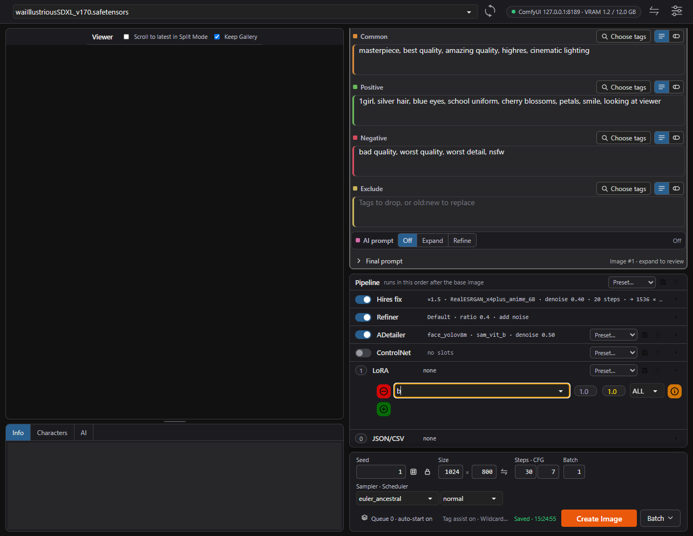

## ADetailer
> [!TIP]
> 設定が分かりにくければ、右下の金色のパラメータ（Denoise）だけ調整すれば OK です。

*ComfyUI の場合*
> [!CAUTION]
> 出所不明・信頼できないサイトの .pt ファイルはダウンロード前に確認してください。
> https://github.com/ltdrdata/ComfyUI-Impact-Pack/issues/843

`ADetailer` には [Impact Pack](https://github.com/ltdrdata/ComfyUI-Impact-Pack) 8.28.3 [latest](https://github.com/ltdrdata/ComfyUI-Impact-Pack/commit/429d0159ad429e64d2b3916e6e7be9c22d025c3c) と [Impact Subpack](https://github.com/ltdrdata/ComfyUI-Impact-Subpack) [latest](https://github.com/ltdrdata/ComfyUI-Impact-Subpack/commit/50c7b71a6a224734cc9b21963c6d1926816a97f1) が必要
`ADetailer` モデルは `ComfyUI\\models\\ultralytics\\bbox` に配置
`SAM` モデルは `ComfyUI\\models\\sams` に配置

*Forge Neo の場合*
`ADetailer` には [ADetailer Neo](https://github.com/Haoming02/ADetailer-Neo) [latest](https://github.com/Haoming02/ADetailer-Neo/commits/main/) が必要
`Upscaler`、`Control Processor`、`ADetailer` の一覧は API から読み込みます。
既定の ADetailer モデル一覧は初回生成後に更新されます。通常どおり画像を生成してください。
`ADetailer` モデルは `sd-webui-forge-neo\\models\\adetailer` または `stable-diffusion-webui\\models\\adetailer` に配置

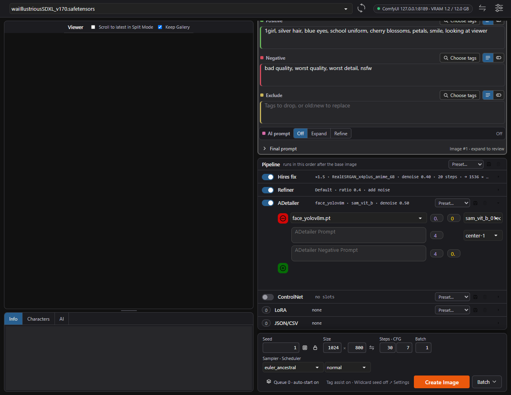

## キューマネージャ
それぞれ異なるパラメータを持つ複数の生成タスクを投入できます。キューは自動的に処理を開始し、完了したタスクを取り除きます。
エラーが発生した場合や `Enable Generation` のチェックを外した場合、現在のタスク終了後にキューは一時停止し、内容は保持されます。
キュー内のタスクは `削除` や `詳細表示` ができます。先頭タスクを削除すると現在の生成がキャンセルされます。
*キューの長さは 10,000 を超えないことを推奨します。*

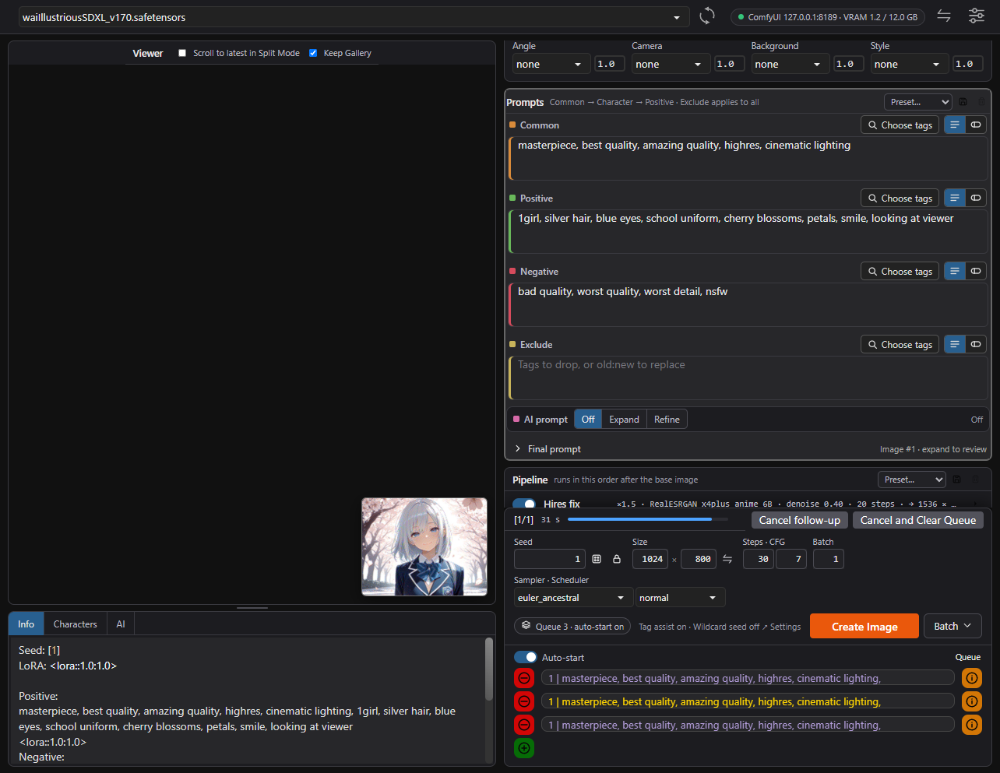

## JSON/CSV リスト
**JSON/CSV リストは設定ファイルには保存されません。**
`*.json` と `*.csv` に対応。`Image Info` ウィンドウにドラッグ&ドロップ（または `Add` → `Paste`）してください。ファイル形式は `wai_characters.csv` と `wai_tag_assist.json` を参考に、それらを SAA にドラッグして試してください。
`__Random__` は Seed に縛られずリストからランダムに 1 項目を選びます。`Single` と `Batch (Random)` モードで動作します。
`__Enumerate__` は全項目を順に列挙します。`Batch (Random)` モードでのみ動作し、`Single` では `__Random__` に格下げされます。

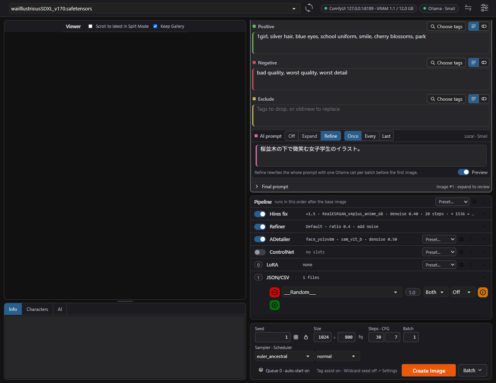

## ワイルドカード
`*.txt` ワイルドカードファイルに対応。`data/wildcards`（パッケージ版は `resources\app\data\wildcards`）にコピーしてください。
既定では現在の Seed でワイルドカードを選択します。`wildcard random seed` をチェックすると、選択のたびに新しいランダム Seed を生成します。
**サブフォルダは非対応です。**

ワイルドカードタグは前後をアンダースコア 2 つ `__` で囲みます。
```
__YourWildCardName__
```

インライン記法も使えます。
```
{ standing | sitting | on stomach | on back }
{ red | green | blue | blonde } { {long | short} hair | eyes}
```

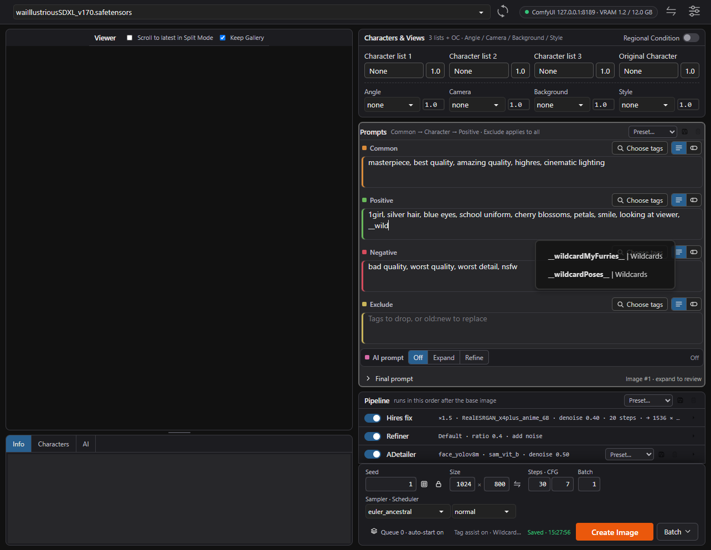

## Regional Condition / Couple
> [!TIP]
> Anima モデルに対応しました。

3 ステップで試せます。
1. `Regional Condition` チェックボックスをオンにする。
2. リストのキャラクターか自分の OC を選ぶ。
3. `common prompt` を `duo, masterpiece, best quality, amazing quality` で始める（品質ワードを忘れずに）。

*Forge Neo の場合*
`Regional Condition` には [SD Forge Attention Couple](https://github.com/Haoming02/sd-forge-couple) [latest](https://github.com/Haoming02/sd-forge-couple/commits/main/) が必要

**左右のサイド（Nishiki）。** Regional を ON にすると、Prompts カードの欄は **BOTH SIDES**（Common、Background、Style、共通 Negative、*Both* に設定したカスタム欄）、**LEFT** / **RIGHT**（各側のキャラクター、Positive、側別 Negative、側限定のカスタム欄）、**ALL**（Exclude）に分かれます。カスタム欄のサイドは Fields エディタで指定します。**Swap** は左右をまとめて入れ替え（プロンプト、Negative、ウェイトプラン、キャラクター、Strength）、Undo できます。旧「Swap Character」スイッチはこれに置き換わりました。キャラクター行をクリックするとキャラクター選択が開き、各側は見出しから折りたためます。ComfyUI では左右の Negative も Positive と同じマスクで領域に適用され、Forge Neo では 1 つの Negative にまとめられます。

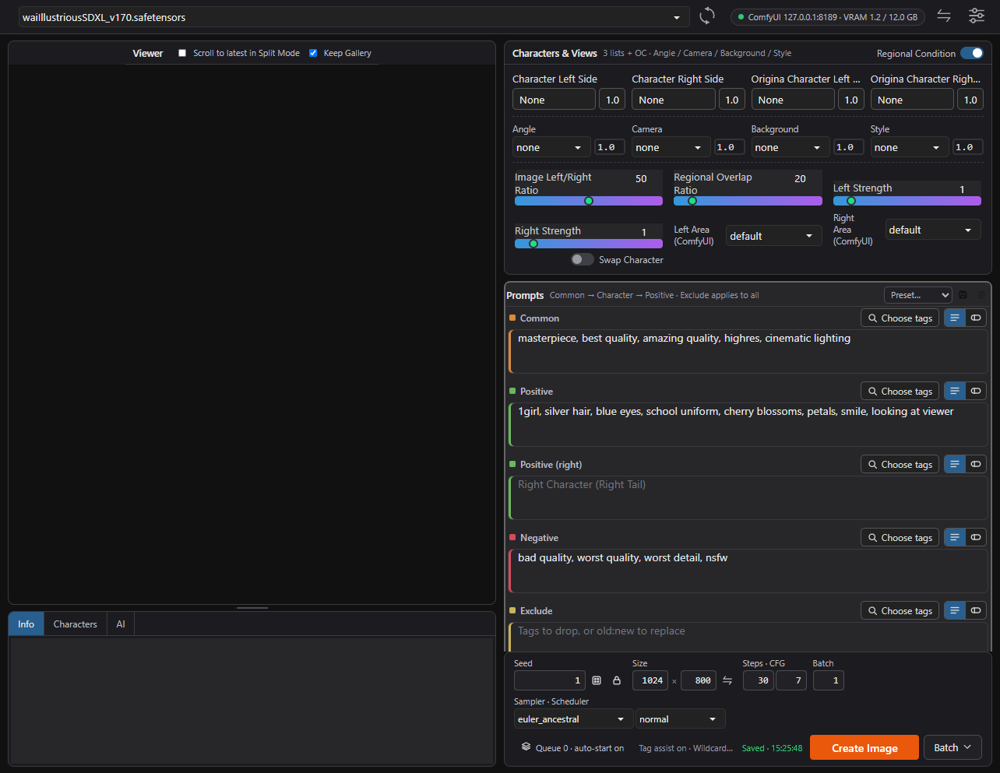

## セミオートタグ補完
タグデータ: [DraconicDragon/dbr-e621-lists-archive/danbooru_e621_merged_2026-04-01_pt20-ia-dd-ed-spc.csv](https://github.com/DraconicDragon/dbr-e621-lists-archive/blob/main/tag-lists/danbooru_e621_merged/README.MD)


<details>
<summary>セミオートタグ補完の詳細</summary>
最初の数文字を入力すると一致するタグを検索します。Nishiki では既定で前方・中間・後方一致すべてに対応し、`*tag` と `*tag*` も明示的な後方 / 中間一致パターンとして使えます。
マウスのほか、`キーボードの上下` と `Enter` / `Tab` で選択でき、`Esc` で候補を閉じます。
`ctrl + ↑` / `ctrl + ↓` で現在のタグや選択範囲のウェイトを調整できます（ComfyUI や WebUI と同様ですが細部のロジックは異なる場合があります）。

英語・中国語・日本語のタグ検索に対応。
**中国語タグ翻訳に協力してくださった Kiratian(天痕) に感謝します。**

*Anima などのアーティスト検索*
`@` で有効になります。結果はグループ `1` と `8` でフィルタされます。
`Anima モデル` で `Artist` タグを使うには先頭に `@` を付けます。例: `mira` → `@mira`

| Mark | ID | Category | Group |
| --- | --- | --- |  --- |
| `[G]` | 0 | General | Danbooru |
| `[A]` | 1 | Artist | Danbooru |
| `[©]` | 3 | Copyright | Danbooru |
| `[C]` | 4 | Character | Danbooru |
| `[M]` | 5 | Meta | Danbooru |
| `<G>` | 7 | General | E621 |
| `<A>` | 8 | Artist | E621 |
| `<©>` | 10 | Copyright | E621 |
| `<C>` | 11 | Character | E621 |
| `<S>` | 12 | Species | E621 |
| `<M>` | 14 | Meta | E621 |
| `<L>` | 15 | Lore | E621 |
| `Wildcards` | 255 | Wildcards | SAA |
</details>

## Image info
<details>
<summary>画像を SAA ウィンドウにドラッグ&ドロップ。Png/Jpeg/Webp に対応。</summary>
WebUI（Forge Neo と A1111）と ComfyUI（ComfyUI_Mira の画像保存ノード使用時）で動作します。
画像をダブルクリックで閉じます。
`Send` ボタンは `Common Prompt`、`Negative Prompt`、`Width & Height`、`CFG`、`Step`、`Seed` を上書きします。
同じ LoRA を持っていれば `Common Prompt` 内の LoRA も機能します。プロンプト内の LoRA が不要なら `Send LoRA to Slot` を試してください。

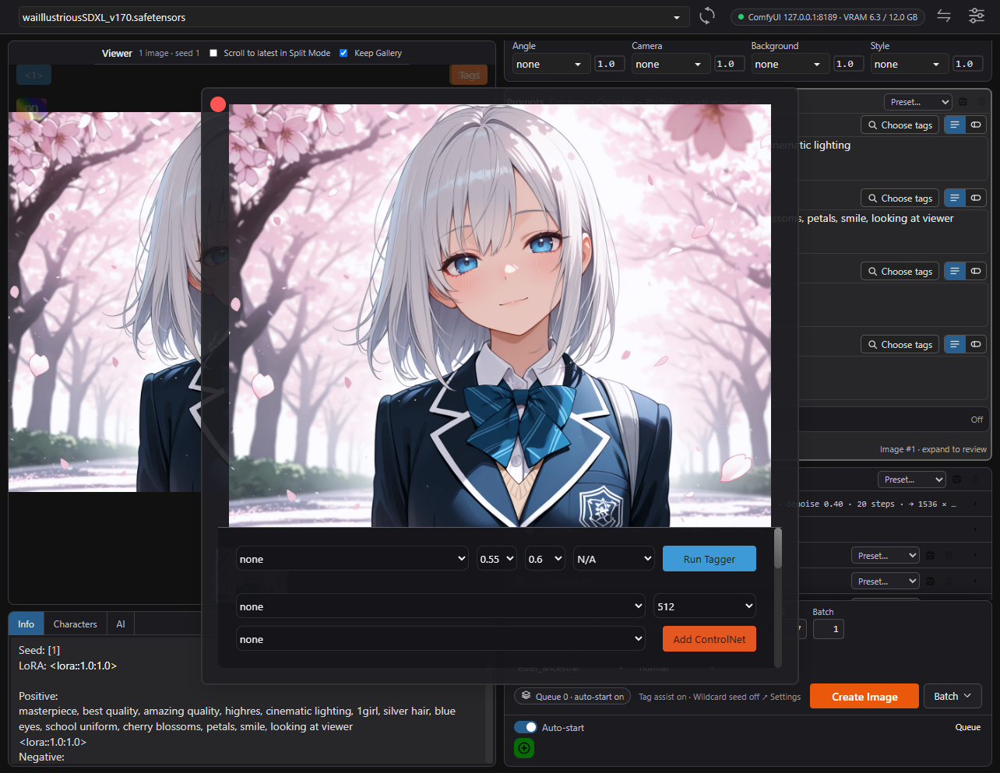
</details>

## キャラクターリスト
### お気に入り
キャラクター、オリジナルキャラクター、タグのお気に入りは選択モーダルで管理します。モーダルを開いてエントリの星を切り替え、上部のお気に入りグループから再び探せます。お気に入りタグはカプセル上で強調表示されます。お気に入りは設定と一緒に保存されます。

### プレビューと検索
キャラクターリストは英語・中国語・日本語のキーワード検索に対応しています。


## 上部ボタンと右クリックメニュー
上部ボタンは左から: 設定保存、モデル一覧再読込、ページ更新、右から左、テーマ切替、Undo、Redo、GPU ターゲット（Local / Pod）。

<details>
<summary>右クリックメニュー</summary>

メニューは右クリックした対象で変わります。カプセル（ウェイト編集、有効 / 無効、関連タグ、コピー、削除、他の欄へ移動 / コピー）、プロンプト欄（欄のコピー / クリア、全タグ有効 / 無効、LoRA をスロットへ送る、選択範囲の移動 / コピー）、ギャラリー画像（画像 / メタデータのコピー、現在の画像を削除、ギャラリーをクリア）、AI 欄（AI 生成テスト）。

**スペルチェック（英語）**
スペルチェックエラー（波線）のある単語を右クリックすると候補が表示されます。
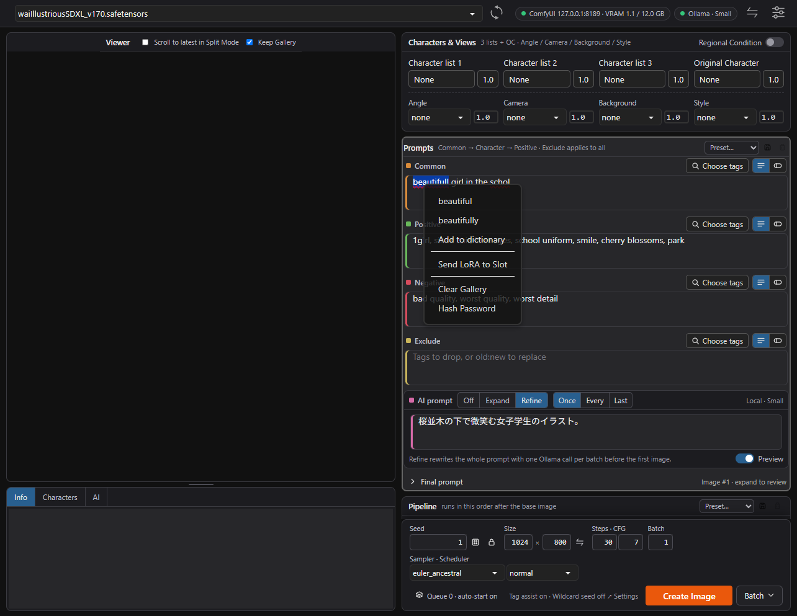

**AI プロンプト生成テスト**
`AI prompt` 欄を右クリックすると、生成せずに AI プロンプトを取得します。結果は Info パネルの AI タブに表示されます。AI ルールを `Last` にすると以降の生成でその結果を再利用します。
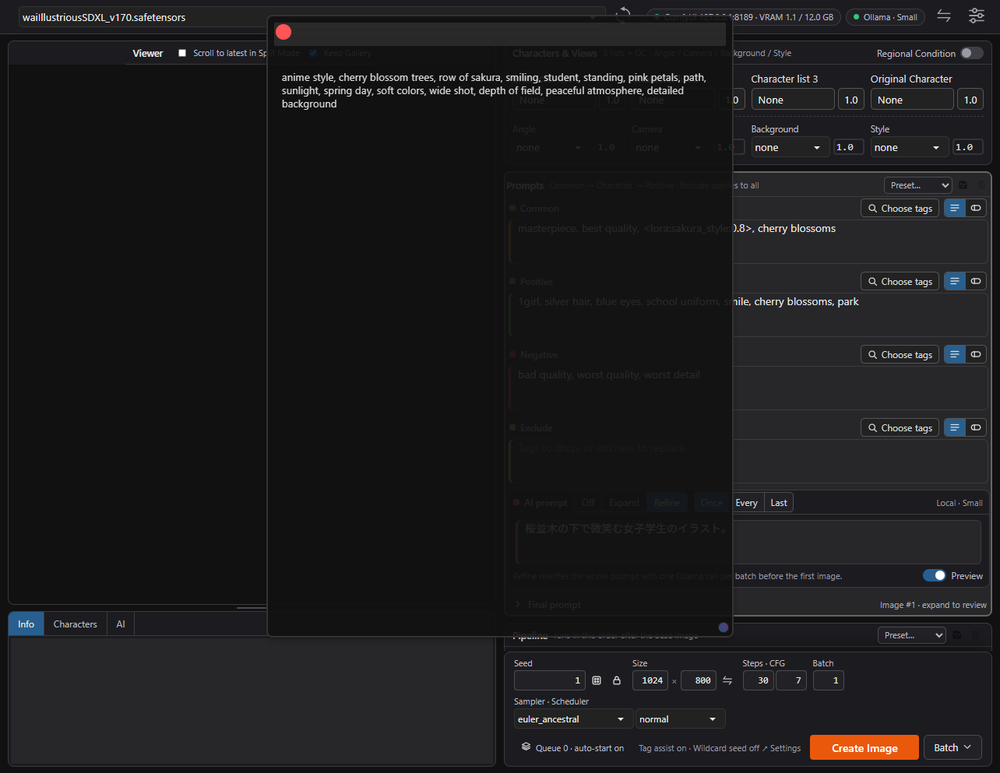

**画像 / メタデータのコピー**
`Gallery` を右クリックすると現在の画像またはメタデータをクリップボードにコピーします。
Image Saver ノードを使う ComfyUI では a1111 形式に近いメタデータが出力されます。
画像コピーは base64 を PNG に戻しますが、Chromium コアによりメタデータは除去されます。元画像が必要なら ComfyUI/WebUI の出力フォルダを確認してください。
SAAC の場合: ブラウザからローカルフォルダへ画像をドラッグするか、ブラウザメニューの `名前を付けて保存` を使ってください。
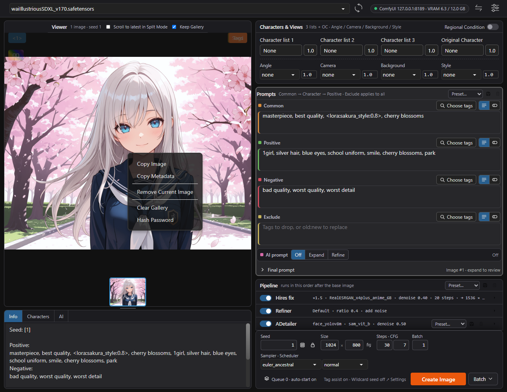

**LoRA をスロットへ送る**
`Common` または `Positive` を右クリックすると、テキスト形式の LoRA を LoRA スロットへ送ります。
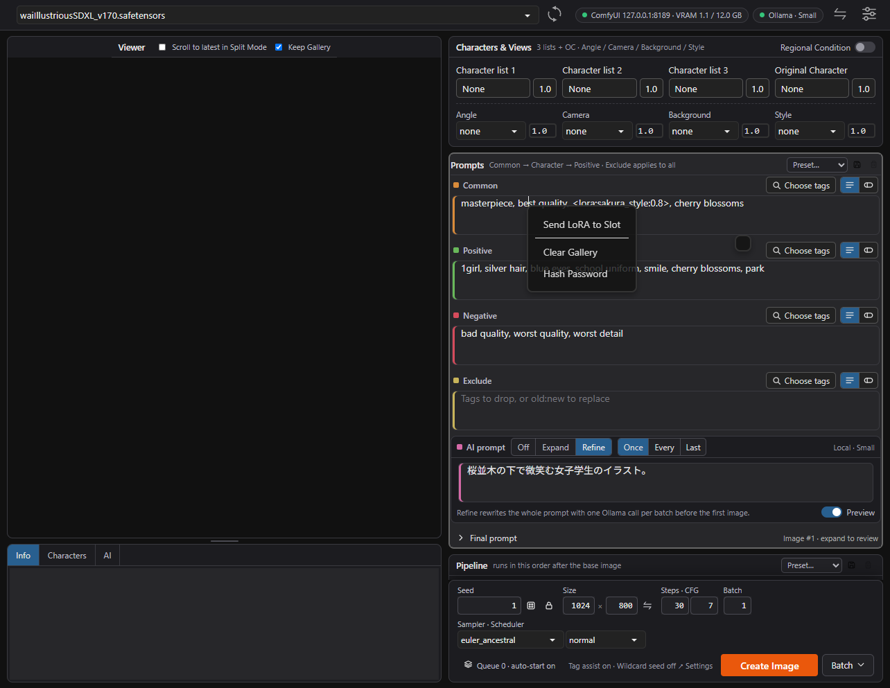
</details>

------
# AI プロンプト
リモート
1. セットアップガイドに従って `Remote AI url`、`Remote AI model`、`API Key` を設定します。
2. `AI Prompt` に何か入力します。例: `make character furry, and I want a detailed portrait`

ローカル
1. [Llama.cpp](https://github.com/ggml-org/llama.cpp) を自分でビルドするか、[信頼できるソース](https://github.com/ggml-org/llama.cpp/releases) からダウンロードします。
2. [HuggingFace](https://huggingface.co/) からモデルをダウンロードします。`oh-dcft-v3.1-claude-3-5-sonnet-20241022.Q8_0`（[こちら](https://huggingface.co/mradermacher/oh-dcft-v3.1-claude-3-5-sonnet-20241022-GGUF)）のような GGUF を推奨。
3. 推奨サーバー引数: `llama-server.exe -c 16384 --port <your local LLM port> -m "<your GGUF model here>"`
4. `AI Prompt Generator` を `Local` にします。
5. `Local Llama.cpp server` にローカル AI のアドレスとポートを設定します。
6. （任意）他のローカル AI サービスを使う場合は API 設定を確認してください。
7. `AI Prompt` に `make character furry, and I want a detailed portrait` のように入力します。

Refine（Nishiki）
1. [Ollama](https://ollama.com/) をインストールし、モデルを pull します。
2. AI モードを `Refine` にし、Ollama のアドレスとモデルを入力します。
3. 普段どおりプロンプトを書きます。各バッチの 1 枚目の前に、Refine が構造化リクエスト 1 回でプロンプト全体を書き直し、結果をエディタに適用します。気に入らなければ `Ctrl + Z` で戻せます。
4. Runpod の Pod を登録していれば、AI のホストに `Pod` を選べます。

------
# Image API Interface
*ComfyUI の場合*
> [!IMPORTANT]
> ワークフローが正しく読み込めない場合は、代わりに `2025-05-03-022732_1775747588.json` を使ってください。

1. ComfyUI の設定で `DEV mode` を有効にし、`examples\2025-05-03-022732_1775747588.png` を ComfyUI に読み込みます。[ComfyUI_Mira](https://github.com/mirabarukaso/ComfyUI_Mira) **v0.5.6.0 以上** がインストールされていることを確認してください。
    1.1. ComfyUI → Manager → Install PIP packages → opencv-python で `opencv-python` のインストールが必要な場合があります。
2. `Image API Interface` を `ComfyUI` にします。
3. `Image Interface IP Address:Port` が ComfyUI のページと一致していることを確認します。
4. 楽しんでください。

SAA でプレビューが表示されない場合は、起動 BAT に `--preview-method latent2rgb` を追加してください。
```
py ComfyUI\main.py --fast --use-sage-attention --cuda-malloc --windows-standalone-build --listen 0.0.0.0 --port 58188 --preview-method latent2rgb
```

*Forge Neo（WebUI）の場合*
1. `COMMANDLINE_ARGS`（webui-user.bat）に ` --api` を追加して `API mode` を有効にします。
2. WebUI を起動します。
3. `Image API Interface` を `WebUI` にします。
4. `Image Interface IP Address:Port` が WebUI のページと一致していることを確認します。
5. 楽しんでください。

## サードパーティ混在バックエンド向けカスタムパス
> [!WARNING]
> カスタムパスを有効にするとモデルパス設定が上書きされます。
> 公式の WebUI（Forge Neo/A1111）や ComfyUI では推奨しません。

`data/custom_path.yaml` を編集します。
1. `use_custom_path` を `true` にします。
2. カテゴリ全体を無効にするには `enable` を `false` にします。
3. 上書きしたくない個別のカスタムパスはコメントアウトします。
4. パス一覧は単一文字列・複数行文字列の両方に対応します。
5. 絶対パスと相対パス（base_path 基準）に対応します。

[#92 Stability Matrix で ComfyUI を使う場合のカスタムパス設定](https://github.com/mirabarukaso/character_select_stand_alone_app/issues/92)

## リモート利用時のフォルダパス問題
SAA はモデル・LoRA などを一覧するために ComfyUI/WebUI の checkpoints フォルダを検索します。バックエンドアドレスがリモート（127.0.0.1 以外）の場合、フォルダ検索に失敗し SAA は `Default` モードで動作します。このモードではモデル変更や LoRA スロットの設定ができません。
解決策は 2 つ:
1. `ミラーフォルダ` — リモートの `models` フォルダをローカルにコピーし、SAA にそのフォルダを設定します。簡単ですがディスク容量が必要です。
2. `シンボリックリンクまたは共有フォルダ` — シンボリックリンクを作るか、リモートの `models` フォルダを共有（読み取り専用推奨）し、SAA にそのフォルダを設定します。

## 高度なセキュリティ設定（API 認証）
> [!WARNING]
> *保護されていないローカルポートを公開インターネットに転送しないでください。*
> *WebUI（Forge Neo）のみ。適切で安全な方法が用意されるまで ComfyUI API を公開インターネットに転送しないでください。*

WebUI（Forge Neo）のコマンド引数は [Command-Line-Arguments-and-Settings](https://github.com/AUTOMATIC1111/stable-diffusion-webui/wiki/Command-Line-Arguments-and-Settings) を参照。

`webui-user.bat` を `webui-user-api.bat` にコピーし、以下の引数で編集します。
`user:pass` を自分の `ユーザー名:パスワード` に置き換えてください。
`--api` `--api-auth` は API と API 認証を有効にします。
`--nowebui` はブラウザ UI が不要な場合に指定します。
`--port 58189` は API ポートを `58189` にします。
```
set COMMANDLINE_ARGS= --xformers --no-half-vae --api --api-auth user:pass --nowebui --port 58189
```
新しい `webui-user-api.bat` で Forge Neo を起動します。
`ユーザー名:パスワード` を SAA → Settings → `WebUI API Auth` に貼り付け、`Enable` を `ON` にします。

------
# Hires Fix と Image Color Transfer
Image Color Transfer の詳細は [Image Color Transfer](https://github.com/mirabarukaso/ComfyUI_Mira#image-color-transfer) を参照してください。
*生成ルールがなく openCV も無いため、WebUI では Color transfer に対応しなくなりました。*

すべてのアップスケーラーモデルを `upscale_models` フォルダに置いてください。

ComfyUI の注意:
アップスケールモデルは自分でダウンロードします。`Manager` → `Model Manager` で `upscale` で絞り込んでください。

WebUI（Forge Neo/A1111）のアップスケーラーの注意:
WebUI は名前ベースのアップスケーラー一覧を使います。`静的なアップスケーラー一覧` が動作し、初回生成後に API の一覧に更新されます。

Forge はファイルベースの一覧を使いますが、これが厄介です。
  **重要: upscale_models フォルダが存在しない場合、SAA は静的な一覧を使います。**
  **迷ったら一度生成してください。HiFix モデル一覧が正しく更新されます。**
  解決策:
  1. `models` 内に `upscale_models` フォルダを作り、すべてのアップスケーラーモデルを入れます。
  2. アップスケーラーモデルのフォルダ名（例: `ESRGAN`）でシンボリックリンクを作り、`upscale_models` を指すようにします。
  3. Forge を再起動します。`Hires Fix` モデルが動作し、初回生成後に API の一覧に更新されます。

------
# 中国語翻訳とキャラクター検証
中国語翻訳とキャラクターデータの検証に貴重な時間を割いてくださった以下の方々に感謝します（順不同）。
**Silence, 燦夜, 镜流の粉丝, 樱小路朝日, 满开之萤, および匿名希望の 2 名。**

# キャラクターリスト Special Thanks
lanner0403 [WAI-NSFW-illustrious-character-select](https://github.com/lanner0403/WAI-NSFW-illustrious-character-select)
Cell1310  [Illustrious XL (v0.1) Recognized Characters List](https://civitai.com/articles/10242/illustrious-xl-v01-recognized-characters-list)
mobedoor [#23](https://github.com/mirabarukaso/character_select_stand_alone_app/issues/23)
UdinXProgrammer [#62](https://github.com/mirabarukaso/character_select_stand_alone_app/issues/62)
Nurimtod [#75](https://github.com/mirabarukaso/character_select_stand_alone_app/issues/75) [#83](https://github.com/mirabarukaso/character_select_stand_alone_app/issues/83)
atmogenic [#84](https://github.com/mirabarukaso/character_select_stand_alone_app/issues/84) [#85](https://github.com/mirabarukaso/character_select_stand_alone_app/issues/85)
funnygeeker [#87](https://github.com/mirabarukaso/character_select_stand_alone_app/issues/87)

------
# FAQ
`saa.exe` をダブルクリックしても何も起きない
1. ファイルのダウンロード失敗やファイル不足が原因の可能性があります。
2. コンソールから実行してください。エクスプローラーのアドレスバーに `cmd` と入力するとコンソールが開きます。
3. `saa` と入力して Enter を押し、バックエンドのログを確認してください。

セットアップウィザードで失敗した
1. アプリを閉じます。
2. `settings`（パッケージ版は `resources/app/settings`）の `app.json` を削除します。
3. もう一度試します。

ERR_CONNECTION_REFUSED
1. ほとんどの場合、（ComfyUI/WebUI）バックエンド API のアドレスが間違っています。

ブラウザ版の SAA は?
1. あります。
2. `高度なセキュリティ設定（API 認証）` を参照してください。

Error HTTP 400 ...... Cannot execute because node StepAndCfg does not exist ......
1. `ComfyUI_Mira` をインストールします。
2. ComfyUI を再起動します。

Upscale モデル一覧が `None`（ComfyUI）
1. 既定のディレクトリ設定を変更していませんか?
2. 非公式版ではありませんか?
3. [#58](https://github.com/mirabarukaso/character_select_stand_alone_app/issues/58) を確認してください。

ComfyUI/WebUI is busy, cannot run new generation, please try again later.
[README_SAAC.md](README_SAAC.md) の 5 と 6 を参照してください。

設定やプリセットはどこにある?
1. `settings/app.json`、`settings/state.json`、`settings/presets/`、`settings/user_lists.json` です。[設定の保存先](#設定の保存先) を参照してください。
2. Nishiki 以前の `settings/*.json` は初回起動時に `settings/legacy/` へ移動されます。
